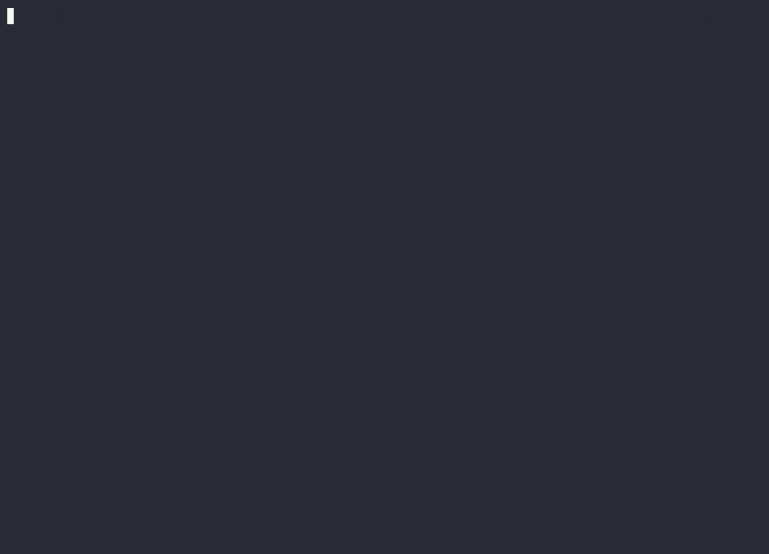

# ft-drift


<!-- WARNING: THIS FILE WAS AUTOGENERATED! DO NOT EDIT! -->

`ft-drift` helps you check for data drift by comparing two OpenAI
[multi-turn chat jsonl
files](https://platform.openai.com/docs/guides/fine-tuning/preparing-your-dataset).

## Install

``` sh
pip install ft_drift
```

## Background

Common situations where you want to check for dataset drift:

1.  You fine-tuned a new model but it doesn’t work the way you expect
    compared to a previous model trained on different data.
2.  Your model is trained on data that doesn’t reflect production.

In either situation, you can collect your data from the relevant sources
and compare them to see if the data has changed in ways that are
undesirable.

In the demo below, we detect data drift between two datasets where the
following tokens were found to be different:

- `END-UI-FORMAT`
- `UI-FORMAT`
- “\`\`\`json”
- etc.

## Usage

After installing `ft_drift`, the cli command `detect_drift` will be
available to you.


