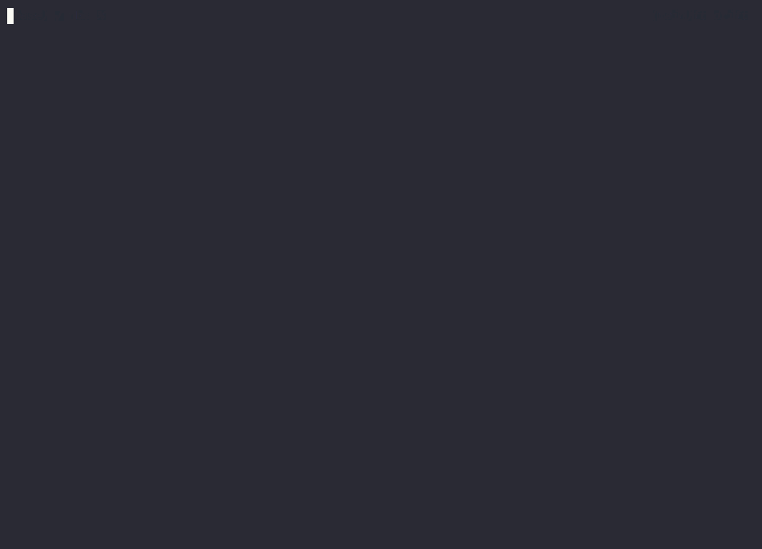
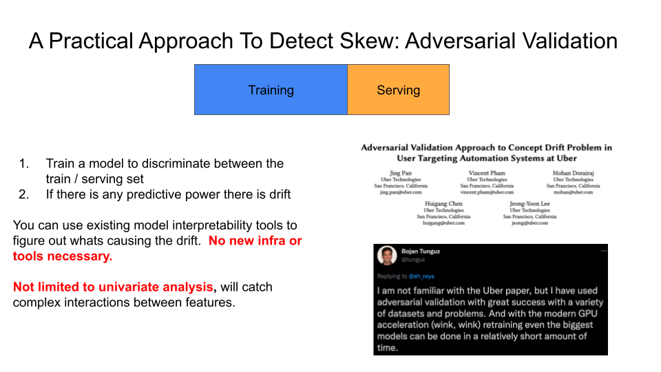

# ft-drift


<!-- WARNING: THIS FILE WAS AUTOGENERATED! DO NOT EDIT! -->

`ft-drift` helps you check for data drift by comparing two OpenAI
[multi-turn chat jsonl
files](https://platform.openai.com/docs/guides/fine-tuning/preparing-your-dataset).

## Install

``` sh
pip install ft_drift
```

## Background

Checking for dataset drift can help you debug if:

1.  Your model is trained on data that doesn’t reflect production
    (different prompts, functions, etc).
2.  Your training data contains unexpected or accidental artifacts.

In either situation, you can compare data from relevant sources
(i.e. production vs fine-tuning) to find unwanted changes. This is one
of the most common source of errors when fine-tuning models!

The demo below shows a cli tool used to detect data drift between two
files, `file_a.jsonl` and `file_b.jsonl`. Afterwards, a table of
important tokens that account for the drift are shown, such as:

- `END-UI-FORMAT`
- `UI-FORMAT`
- “\`\`\`json”
- etc.

**Currently, `ft_drift` only detects drift in prompt templates and other
token-based drift (as opposed to semantic drift)**.

## Usage

After installing `ft_drift`, the cli command `detect_drift` will be
available to you.



## How Does it Work?

This works by doing the following steps:

1.  Fit a binary classifier (random forest) to discriminate between two
    datasets.
2.  If the classifier can predict a material difference (ex: AUC \>=
    0.60) then we know there is drift (something is systematically
    different b/w the two datasets).
3.  We show the most important features from the classifier which are
    tokens (segments of text) to help you debug what is different.

If this tool doesn’t detect drift, it doesn’t mean drift doesn’t exist.
It just means we didn’t find it. For more background on this approach,
see this slide from [my talk on MLOps
tools](https://www.youtube.com/watch?v=GHk5HMW4XMA):



## TODO

Other things that could be added:

- [ ] Semantic drift by incorporating embeddings.
- [ ] More features: length of messages, \# of turns etc.
- [ ] Wiring up the function definition diff to the CLI (I don’t need
  this yet for my use case).
